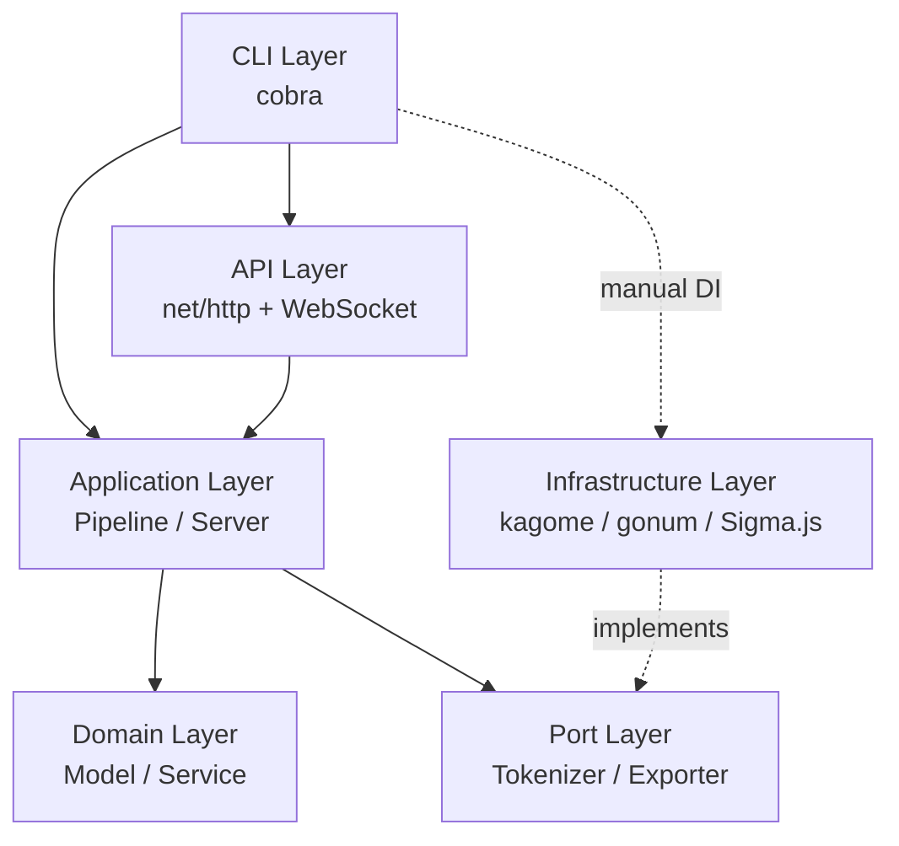
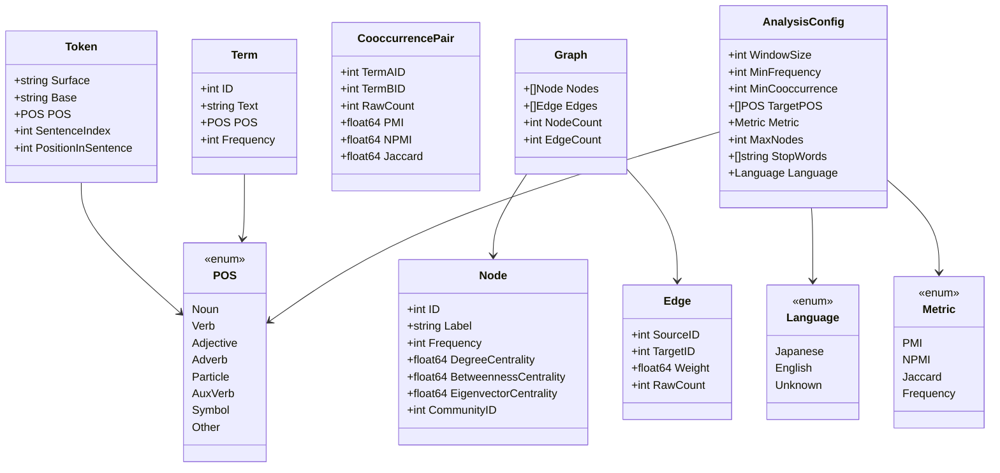
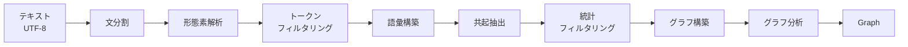
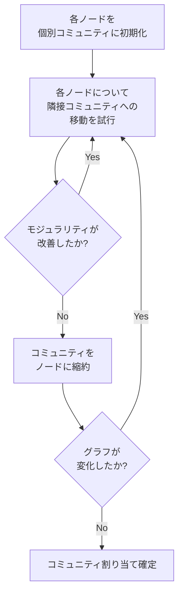
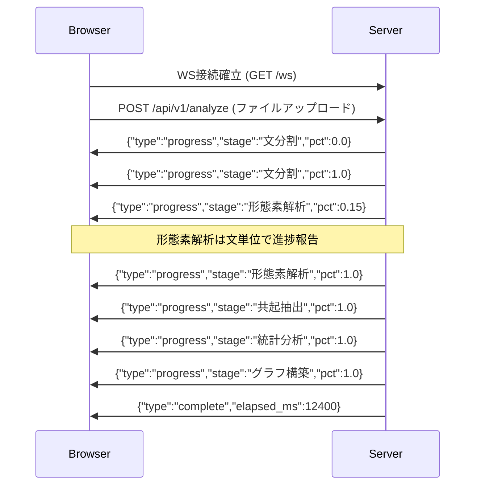
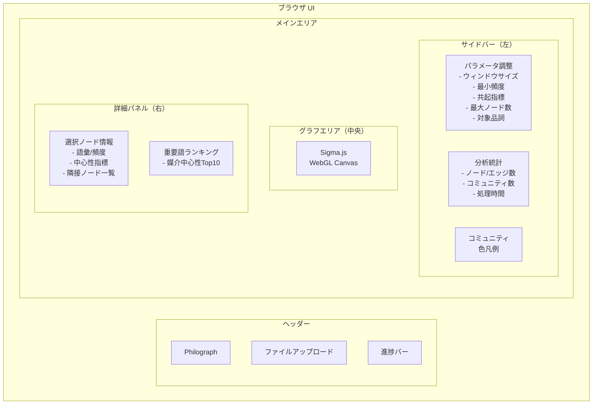
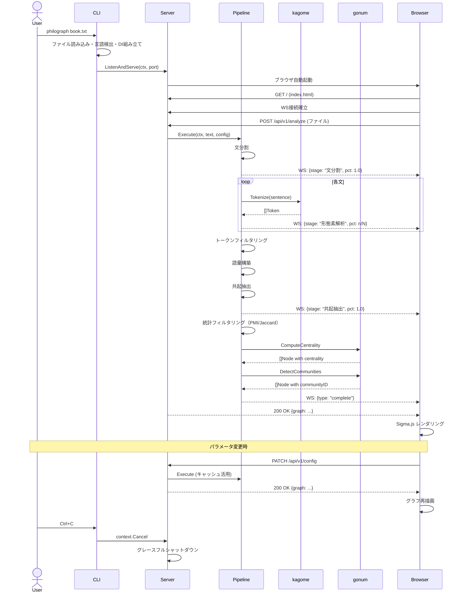
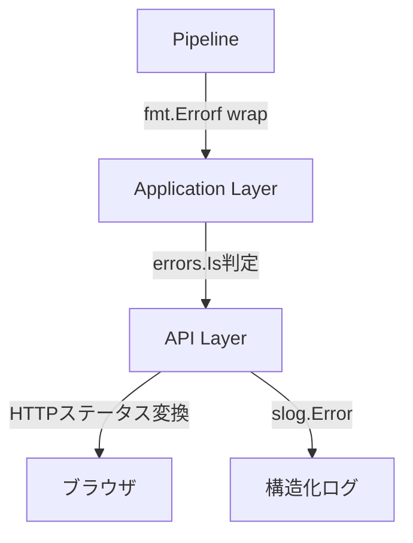

# Philograph 技術設計書

<aside>
📋

**文書情報**

*プロジェクト名:* Philograph

*バージョン:* 1.0.0

*著者:* 坂下 康信

*最終更新:* 2026-03-07

*ステータス:* Final

</aside>

---

## 1. 概要

**Philograph** は、書籍一冊分のテキストを入力として共起ネットワークを構築し、ブラウザ上でインタラクティブに可視化するコマンドラインツールである。プロジェクト名は古代ギリシャ語の φίλος（愛する）と γράφω（描く）に由来し、「概念の関係を描き出す」という本ツールの目的を表現する。

**設計目標**

- テキストファイルひとつで即座に共起ネットワーク分析を開始できるゼロ設定動作
- 形態素解析・共起抽出・統計フィルタリング・グラフ分析を統合したNLPパイプライン
- Sigma.js/WebGLによる数百ノード規模のインタラクティブなグラフ可視化
- ブラウザUIを含むすべてのアセットを単一バイナリに同梱したポータブル配布
- ポート＆アダプタ・パターンによる形態素解析器の差し替え可能な言語非依存設計

---

## 2. 背景と課題

哲学書をはじめとする人文系テキストは、概念間の関係が複雑に絡み合い、通読だけではテキスト全体の構造を俯瞰することが困難である。「精神現象学のキーワード間の関係をネットワーク図で一望できれば、テキストの理解が劇的に変わる」という着想が本プロジェクトの出発点である。

既存ツールとしてKH Coderが広く使われているが、以下の課題がある。

- Java + R + 形態素解析器（MeCab/ChaSen）の個別インストールが必要で、環境構築のハードルが高い
- GUIアプリケーションであり、CIパイプラインへの統合やバッチ処理が困難
- グラフ可視化は静的画像の出力であり、インタラクティブな探索ができない
- 多言語テキストへの対応に追加設定が必要

<aside>
💡

**解決方針:** Pure Goの形態素解析器kagomeで辞書をバイナリに内包し、gonum/graphでグラフ計算を実行し、Sigma.jsのWebGL描画をembed.FSで同梱する。これにより、単一バイナリの実行だけでテキストファイルから共起ネットワークの可視化までを完結させる。

</aside>

---

## 3. 要件定義

### 3.1 機能要件

- **FR-01** UTF-8テキストファイル（.txt）を入力として受け取る
- **FR-02** 日本語テキストの形態素解析（品詞タグ付き）を実行する
- **FR-03** 英語テキストのトークン化（空白分割＋レンマ化）をサポートする
- **FR-04** テキストの言語を自動検出する（Unicode符号点分布に基づく）
- **FR-05** 設定可能なウィンドウサイズで共起ペアを抽出する
- **FR-06** 複数の共起指標（PMI, Jaccard, 生頻度）を選択可能にする
- **FR-07** グラフ中心性（次数・媒介・固有ベクトル）を算出する
- **FR-08** Louvain法によるコミュニティ検出を実行する
- **FR-09** ブラウザ上でForce Atlas 2レイアウトのインタラクティブなネットワークグラフを表示する
- **FR-10** 分析パラメータをブラウザUI上で変更し、再分析を即座に反映する
- **FR-11** グラフをJSON/GEXF形式でエクスポートする（Gephi等の外部ツールとの連携を考慮）
- **FR-12** 分析の進捗をWebSocket経由でリアルタイム通知する
- **FR-13** カスタムストップワードリストをファイルで指定可能にする

### 3.2 非機能要件

- **NFR-01** 外部ランタイム依存なしの単一バイナリとして配布可能であること
- **NFR-02** 50万文字のテキストを30秒以内に分析完了できること（一般的なデスクトップ環境）
- **NFR-03** メモリ使用量が500MB以下であること（書籍一冊分のテキスト処理時）
- **NFR-04** 500ノード・2000エッジ規模のグラフを60FPSでレンダリングできること
- **NFR-05** Linux / macOS / Windowsのクロスプラットフォームで動作すること
- **NFR-06** `Ctrl+C` でのグレースフルシャットダウンをサポートすること

### 3.3 制約事項

- PDF/EPUB等のバイナリ形式は処理対象外とする（事前にテキスト抽出が必要）
- 入力ファイルサイズの上限は50MBとする
- 永続化機能は持たない（分析結果はサーバープロセスの存続中のみ保持）
- 同時に分析できるテキストは1ファイルのみとする

---

## 4. 技術スタック

### 4.1 言語・ランタイム

- **Go 1.23+**
    - `embed.FS` による静的アセット同梱、`net/http` の拡張パターンマッチング（Go 1.22+）、`log/slog` 構造化ログ（Go 1.21+）など標準ライブラリのモダン機能を全面活用
    - シングルバイナリ・クロスコンパイル・高速ビルドにより配布とCIを簡素化

### 4.2 NLP

- **kagome v2** (Apache 2.0)
    - Pure Goの形態素解析器。IPAdic辞書をバイナリに内包し、外部のMeCab/ChaSenインストールを完全に不要にする
    - 選定理由: Go唯一の実用的な日本語形態素解析器であり、辞書同梱によるゼロ設定動作が本プロジェクトの要件に合致する。精度はMeCabとほぼ同等

### 4.3 グラフ計算

- **gonum** (BSD 3-Clause)
    - Go科学計算ライブラリの標準。`gonum/graph` パッケージがグラフデータ構造・探索・中心性・コミュニティ検出を提供
    - 選定理由: Goエコシステムで唯一の本格的なグラフ計算ライブラリ。`graph/network` の中心性算出と `graph/community` のLouvain法実装が本プロジェクトの要件を網羅する
- **gonum/mat** (BSD 3-Clause)
    - 疎行列演算。共起行列の構築と操作に使用

### 4.4 WebSocket

- [**nhooyr.io/websocket**](http://nhooyr.io/websocket) (ISC)
    - 標準ライブラリスタイルのAPI。分析進捗のリアルタイム通知に使用
    - 選定理由: `gorilla/websocket` よりAPIが洗練されており、`context.Context` との統合が自然

### 4.5 フロントエンド

- **Sigma.js v2** (MIT) + **Graphology** (MIT)
    - WebGLベースのグラフ描画ライブラリ。数千ノード規模でも60FPSを維持する
    - Graphologyはグラフのデータ構造を提供し、Sigma.jsの描画エンジンと組み合わせて使用する
    - 選定理由: D3.jsのforce-directedレイアウトはSVGベースで数百ノードが限界。Sigma.jsはWebGL描画により桁違いのパフォーマンスを実現する
- **Vanilla JavaScript (ES Modules)**
    - フレームワーク依存なし。ビルドステップなしでembed.FSに直接同梱
    - 選定理由: フロントエンドの規模が小さく（単一ページアプリケーション）、ビルドツールチェーンの複雑性を回避する

### 4.6 CLI

- **cobra** (Apache 2.0)
    - Go標準のCLIフレームワーク。サブコマンド、フラグ解析、自動ヘルプ生成を提供

### 4.7 テスト

- **testing** (標準ライブラリ) + **testify** (MIT)
    - テーブル駆動テストとアサーションライブラリの組み合わせ

### 4.8 ビルド・配布

- **GoReleaser**
    - マルチプラットフォームバイナリのビルドとGitHub Releasesへの自動公開
- **GitHub Actions**
    - CI/CDパイプライン。テスト・リント・ビルド・リリースを自動化

<aside>
⚠️

**kagomeの辞書サイズに関する注意:** kagome v2 + IPA辞書を含むバイナリサイズは約**50MB**になる。`upx` による圧縮で30MB程度まで削減可能だが、起動時の展開オーバーヘッドとのトレードオフがある。本プロジェクトでは起動速度を優先し、圧縮は適用しない方針とする。

</aside>

---

## 5. アーキテクチャ設計

### 5.1 設計原則

- **クリーンアーキテクチャ:** ドメインロジック（NLPパイプライン、グラフ計算）を外部ライブラリから完全に隔離し、テスタビリティを最大化する
- **ポート＆アダプタ（ヘキサゴナル）:** ドメインが必要とする外部機能（形態素解析、グラフ描画データ出力）をポートインターフェースで定義し、インフラ層が実装する。形態素解析器をkagomeからMeCabバインディングや別言語のトークナイザーに差し替えても、ドメイン層に影響しない
- **パイプラインパターン:** NLP処理を独立したステージ（トークン化→フィルタリング→共起抽出→統計フィルタリング→グラフ構築→グラフ分析）に分解し、各ステージを個別にテスト・差し替え可能にする
- **ゼロ設定駆動:** すべてのパラメータに合理的なデフォルト値を設定し、ユーザーはテキストファイルを渡すだけで分析結果を得られるようにする
- **エフェメラル設計:** 永続化層を持たない。分析結果はプロセスのメモリ上にのみ存在し、終了時に破棄される。これにより、データベース依存を排除し、単一バイナリの自己完結性を保つ

### 5.2 レイヤー構成



- **Domain Layer**: 外部依存ゼロ。トークン・語彙・共起ペア・グラフの値オブジェクトと、共起抽出・統計フィルタリング・グラフ構築のドメインサービスを担当
- **Port Layer**: ドメインが外部に求めるインターフェースを定義。形態素解析（Tokenizer）とグラフデータ出力（Exporter）
- **Infrastructure Layer**: kagome、gonum、JSONエクスポーターによるPort実装。ライブラリ固有の処理をここに閉じ込める
- **Application Layer**: パイプラインオーケストレーション、分析セッション管理、進捗通知。ドメインとPortを組み合わせるユースケース実行単位
- **API Layer**: HTTPハンドラ、WebSocket Hub、静的ファイル配信。ブラウザとの通信を担当
- **CLI Layer**: cobraによるコマンドライン引数パース、手動DI、エントリポイント

### 5.3 パッケージ構造

```jsx
philograph/
├── cmd/philograph/
│   └── main.go                          // エントリポイント・DI
├── internal/
│   ├── domain/
│   │   ├── model/
│   │   │   ├── token.go                  // Token, POS
│   │   │   ├── term.go                   // Term（語彙）
│   │   │   ├── cooccurrence.go           // CooccurrencePair, CooccurrenceMatrix
│   │   │   ├── graph.go                  // Graph, Node, Edge
│   │   │   ├── config.go                 // AnalysisConfig
│   │   │   ├── language.go               // Language enum, 言語自動検出
│   │   │   └── metrics.go                // Metric enum (PMI, Jaccard, Frequency)
│   │   └── service/
│   │       ├── sentencesplitter.go        // 文分割
│   │       ├── tokenfilter.go            // トークンフィルタリング
│   │       ├── cooccurrence_builder.go   // 共起抽出
│   │       ├── statistical_filter.go     // PMI/Jaccard算出・フィルタリング
│   │       └── graph_builder.go          // グラフ構築・中心性・コミュニティ
│   ├── port/
│   │   ├── tokenizer.go                  // Tokenizer interface
│   │   └── exporter.go                   // Exporter interface
│   ├── application/
│   │   ├── pipeline.go                   // 分析パイプライン
│   │   ├── session.go                    // 分析セッション（キャッシュ管理）
│   │   └── progress.go                   // ProgressListener interface
│   ├── infrastructure/
│   │   ├── kagome/
│   │   │   └── tokenizer.go              // kagomeアダプタ（日本語）
│   │   ├── whitespace/
│   │   │   └── tokenizer.go              // 空白分割アダプタ（英語）
│   │   ├── graph/
│   │   │   └── analyzer.go               // gonumアダプタ
│   │   └── export/
│   │       ├── json.go                   // JSONエクスポーター
│   │       └── gexf.go                   // GEXFエクスポーター
│   └── api/
│       ├── server.go                     // HTTPサーバー起動・グレースフルシャットダウン
│       ├── handler.go                    // RESTハンドラ
│       ├── ws.go                         // WebSocket Hub
│       └── middleware.go                 // ロギング・リカバリ
├── web/
│   ├── embed.go                          // //go:embed dist/*
│   └── dist/
│       ├── index.html
│       ├── css/
│       │   └── style.css
│       ├── js/
│       │   ├── app.js                    // メインアプリケーション
│       │   ├── graph.js                  // Sigma.jsラッパー
│       │   ├── controls.js               // パラメータ調整UI
│       │   └── ws.js                     // WebSocketクライアント
│       └── vendor/
│           ├── sigma.min.js
│           ├── graphology.min.js
│           └── graphology-layout-forceatlas2.min.js
├── testdata/
│   ├── japanese_sample.txt               // 日本語テスト用テキスト
│   ├── english_sample.txt                // 英語テスト用テキスト
│   └── golden/                           // ゴールデンファイル
├── go.mod
├── go.sum
├── Makefile
├── .goreleaser.yml
└── .github/
    └── workflows/
        └── ci.yml
```

### 5.4 依存性注入

DIフレームワークは使用しない。`cmd/philograph/main.go` で全ての依存関係を手動で組み立てる。

```go
func run(ctx context.Context, args []string) error {
    cfg := parseFlags(args)

    // 言語検出と適切なTokenizerの選択
    lang := detectLanguage(cfg.inputPath)
    var tokenizer port.Tokenizer
    switch lang {
    case domain.Japanese:
        tokenizer = kagome.NewTokenizer()
    case domain.English:
        tokenizer = whitespace.NewTokenizer()
    }

    // ドメインサービスの組み立て
    splitter := service.NewSentenceSplitter(lang)
    filter := service.NewTokenFilter()
    coocBuilder := service.NewCooccurrenceBuilder()
    statFilter := service.NewStatisticalFilter()
    graphBuilder := service.NewGraphBuilder(graphanalyzer.NewGonumAnalyzer())

    // パイプライン構築
    pipeline := application.NewPipeline(
        tokenizer, splitter, filter,
        coocBuilder, statFilter, graphBuilder,
    )

    // 分析実行
    session := application.NewSession(pipeline)
    progressCh := make(chan application.Progress, 16)

    // HTTPサーバー起動
    srv := api.NewServer(session, progressCh)
    return srv.ListenAndServe(ctx, cfg.port)
}
```

---

## 6. ドメインモデル設計

ドメイン層は外部ライブラリに一切依存しない。Pure Goで構成され、NLPパイプラインの各ステージで使用される値オブジェクトと計算ロジックを担当する。

### 6.1 モデル関係図



### 6.2 値オブジェクト

#### Token

形態素解析の結果を表す。1つの形態素が1つのTokenに対応する。

```go
package model

// POS は品詞を表す文字列型。
// kagomeの品詞体系に依存せず、ドメイン固有の品詞分類を定義する。
type POS string

const (
    POSNoun      POS = "名詞"
    POSVerb      POS = "動詞"
    POSAdjective POS = "形容詞"
    POSAdverb    POS = "副詞"
    POSParticle  POS = "助詞"
    POSAuxVerb   POS = "助動詞"
    POSSymbol    POS = "記号"
    POSOther     POS = "その他"
)

// Token は形態素解析で得られた1トークンを表す。
type Token struct {
    Surface            string // 表層形（テキスト中の出現形）
    Base               string // 基本形（辞書見出し語）
    POS                POS    // 品詞
    SentenceIndex      int    // 所属する文のインデックス（0始まり）
    PositionInSentence int    // 文内での出現位置（0始まり）
}

// IsContent は内容語（名詞・動詞・形容詞・副詞）かどうかを返す。
// 共起ネットワークの構築では機能語（助詞・助動詞等）を除外し、
// 内容語のみを対象とするのが一般的である。
func (t Token) IsContent() bool {
    switch t.POS {
    case POSNoun, POSVerb, POSAdjective, POSAdverb:
        return true
    default:
        return false
    }
}
```

#### Term

レンマ化（基本形への正規化）後の語彙を表す。同一の基本形を持つ複数のTokenが1つのTermに集約される。

```go
package model

// Term は語彙（レンマ化済み）を表す。
// 同一Baseを持つ複数のTokenは1つのTermに集約される。
type Term struct {
    ID        int    // 語彙内での一意なID（0始まり）
    Text      string // 基本形テキスト
    POS       POS    // 品詞（最頻出の品詞を採用）
    Frequency int    // テキスト中の出現頻度
}
```

#### CooccurrencePair

2つの語彙間の共起関係を表す。常に `TermAID < TermBID` の正規化済み順序で格納する。

```go
package model

import "fmt"

// CooccurrencePair は2語間の共起関係を表す。
// TermAID < TermBID の正規化済み順序で格納される。
type CooccurrencePair struct {
    TermAID  int     // 語彙A（ID小）
    TermBID  int     // 語彙B（ID大）
    RawCount int     // 生の共起回数
    PMI      float64 // 自己相互情報量
    NPMI     float64 // 正規化PMI（-1.0〜1.0）
    Jaccard  float64 // Jaccard係数（0.0〜1.0）
}

// Key はマップのキーとして使用するための正規化済み文字列を返す。
func (p CooccurrencePair) Key() string {
    return fmt.Sprintf("%d:%d", p.TermAID, p.TermBID)
}

// NormalizePairOrder はIDの順序を正規化する。
// 共起関係は無向であるため、(A,B) と (B,A) を同一として扱う。
func NormalizePairOrder(a, b int) (int, int) {
    if a > b {
        return b, a
    }
    return a, b
}
```

#### Graph / Node / Edge

共起ネットワークグラフを表す。可視化とエクスポートの入力データとなる。

```go
package model

// Graph は共起ネットワークを表す。
type Graph struct {
    Nodes []Node
    Edges []Edge
}

// NodeCount はノード数を返す。
func (g Graph) NodeCount() int { return len(g.Nodes) }

// EdgeCount はエッジ数を返す。
func (g Graph) EdgeCount() int { return len(g.Edges) }

// Node はネットワーク上の1語彙を表す。
type Node struct {
    ID                     int     // Term.IDに対応
    Label                  string  // 表示用テキスト（Term.Text）
    Frequency              int     // テキスト中の出現頻度
    DegreeCentrality       float64 // 次数中心性
    BetweennessCentrality  float64 // 媒介中心性
    EigenvectorCentrality  float64 // 固有ベクトル中心性
    CommunityID            int     // 所属コミュニティID
}

// Edge はネットワーク上の共起関係を表す。
type Edge struct {
    SourceID int     // ノードA
    TargetID int     // ノードB
    Weight   float64 // 共起強度（選択された指標の値）
    RawCount int     // 生の共起回数
}
```

#### AnalysisConfig

分析パイプライン全体の設定を表す。全フィールドにゼロ設定で動作するデフォルト値を持つ。

```go
package model

// AnalysisConfig は分析パイプラインの設定を表す。
type AnalysisConfig struct {
    WindowSize      int      // 共起ウィンドウサイズ（デフォルト: 5）
    MinFrequency    int      // 最小出現頻度（デフォルト: 3）
    MinCooccurrence int      // 最小共起回数（デフォルト: 2）
    TargetPOS       []POS    // 対象品詞（デフォルト: 名詞, 動詞, 形容詞）
    Metric          Metric   // 共起指標（デフォルト: NPMI）
    MaxNodes        int      // 最大表示ノード数（デフォルト: 150）
    StopWords       []string // 追加ストップワード
    Language        Language // テキスト言語（デフォルト: 自動検出）
}

// DefaultConfig はゼロ設定で動作するデフォルト設定を返す。
func DefaultConfig() AnalysisConfig {
    return AnalysisConfig{
        WindowSize:      5,
        MinFrequency:    3,
        MinCooccurrence: 2,
        TargetPOS:       []POS{POSNoun, POSVerb, POSAdjective},
        Metric:          MetricNPMI,
        MaxNodes:        150,
        StopWords:       nil,
        Language:        LangUnknown, // 自動検出
    }
}
```

#### Language / Metric

```go
package model

import "unicode"

// Language はテキストの言語を表す。
type Language int

const (
    LangUnknown  Language = iota
    LangJapanese          // 日本語
    LangEnglish           // 英語
)

// DetectLanguage はテキストの先頭部分のUnicode符号点分布から言語を推定する。
// CJK統合漢字・ひらがな・カタカナの比率が30%を超える場合は日本語と判定する。
func DetectLanguage(text string) Language {
    const sampleSize = 1000
    cjkCount, totalCount := 0, 0

    for _, r := range text {
        if totalCount >= sampleSize {
            break
        }
        if unicode.IsLetter(r) {
            totalCount++
            if unicode.Is(unicode.Han, r) ||
                unicode.Is(unicode.Hiragana, r) ||
                unicode.Is(unicode.Katakana, r) {
                cjkCount++
            }
        }
    }

    if totalCount == 0 {
        return LangUnknown
    }
    if float64(cjkCount)/float64(totalCount) > 0.3 {
        return LangJapanese
    }
    return LangEnglish
}

// Metric は共起強度の算出指標を表す。
type Metric int

const (
    MetricPMI       Metric = iota // 自己相互情報量
    MetricNPMI                    // 正規化PMI（-1〜1）
    MetricJaccard                 // Jaccard係数（0〜1）
    MetricFrequency               // 生の共起頻度
)
```

---

## 7. NLPパイプライン設計

### 7.1 パイプライン全体像



各ステージはステートレスな関数として実装され、入力と出力が明確に定義される。パイプライン全体の実行はApplication層の `Pipeline` が調整する。

### 7.2 文分割

テキストを文単位に分割する。共起ウィンドウは文の境界を超えないため、文分割の精度が共起ネットワークの品質に直結する。

```go
package service

import (
    "strings"
    "unicode/utf8"
)

// SentenceSplitter はテキストを文単位に分割する。
type SentenceSplitter struct {
    lang model.Language
}

func NewSentenceSplitter(lang model.Language) *SentenceSplitter {
    return &SentenceSplitter{lang: lang}
}

// Split はテキストを文のスライスに分割する。
// 日本語: 句点（。）、感嘆符（！）、疑問符（？）、改行で分割。
// 英語: ピリオド＋空白、感嘆符、疑問符、改行で分割。
func (s *SentenceSplitter) Split(text string) []string {
    var sentences []string
    var current strings.Builder

    for i, r := range text {
        current.WriteRune(r)

        if s.isSentenceEnd(r, text, i) {
            sentence := strings.TrimSpace(current.String())
            if utf8.RuneCountInString(sentence) > 0 {
                sentences = append(sentences, sentence)
            }
            current.Reset()
        }
    }

    // 末尾に残ったテキストを処理
    if remaining := strings.TrimSpace(current.String()); len(remaining) > 0 {
        sentences = append(sentences, remaining)
    }

    return sentences
}

func (s *SentenceSplitter) isSentenceEnd(r rune, text string, pos int) bool {
    switch s.lang {
    case model.LangJapanese:
        return r == '。' || r == '！' || r == '？' || r == '\n'
    default: // English
        if r == '!' || r == '?' || r == '\n' {
            return true
        }
        if r == '.' {
            // ピリオドの後に空白または文末が続く場合のみ文境界とみなす
            // "Dr." や "U.S.A." などの略語を誤分割しない
            next := pos + utf8.RuneLen(r)
            if next >= len(text) {
                return true
            }
            nextRune, _ := utf8.DecodeRuneInString(text[next:])
            return nextRune == ' ' || nextRune == '\n'
        }
        return false
    }
}
```

### 7.3 トークンフィルタリング

形態素解析結果から、共起ネットワーク構築に不要なトークンを除外する。

```go
package service

import (
    "unicode/utf8"

    "github.com/sakashita/philograph/internal/domain/model"
)

// TokenFilter は分析対象外のトークンを除外する。
type TokenFilter struct {
    // 日本語の汎用ストップワード。
    // 哲学テキストでは「こと」「もの」「それ」等が高頻度で出現するが、
    // 概念間の関係を表さないため除外する。
    defaultStopWords map[string]struct{}
}

func NewTokenFilter() *TokenFilter {
    stops := []string{
        "する", "いる", "ある", "なる", "れる", "られる",
        "こと", "もの", "ため", "それ", "これ", "ここ",
        "よう", "ところ", "わけ", "はず", "つもり",
        "さん", "くん", "ちゃん",
        "the", "a", "an", "is", "are", "was", "were",
        "in", "on", "at", "to", "for", "of", "with",
        "and", "or", "but", "not", "be", "have", "has",
        "this", "that", "it", "he", "she", "they",
    }
    m := make(map[string]struct{}, len(stops))
    for _, s := range stops {
        m[s] = struct{}{}
    }
    return &TokenFilter{defaultStopWords: m}
}

// Filter は設定に基づいてトークン列をフィルタリングする。
func (f *TokenFilter) Filter(tokens []model.Token, cfg model.AnalysisConfig) []model.Token {
    posSet := make(map[model.POS]struct{}, len(cfg.TargetPOS))
    for _, p := range cfg.TargetPOS {
        posSet[p] = struct{}{}
    }

    customStops := make(map[string]struct{}, len(cfg.StopWords))
    for _, w := range cfg.StopWords {
        customStops[w] = struct{}{}
    }

    result := make([]model.Token, 0, len(tokens)/2)
    for _, tok := range tokens {
        // 品詞フィルタ
        if _, ok := posSet[tok.POS]; !ok {
            continue
        }
        // ストップワードフィルタ
        if _, ok := f.defaultStopWords[tok.Base]; ok {
            continue
        }
        if _, ok := customStops[tok.Base]; ok {
            continue
        }
        // 1文字トークンの除外（記号や助数詞の残存対策）
        if utf8.RuneCountInString(tok.Base) < 2 {
            continue
        }
        result = append(result, tok)
    }
    return result
}
```

### 7.4 共起抽出アルゴリズム

共起ネットワーク構築の中核となるアルゴリズム。文内のスライディングウィンドウでトークンペアを列挙し、共起回数を集計する。

<aside>
📐

**共起の定義:** 本ツールでは、同一文内で距離がウィンドウサイズ以内にある2語を「共起する」と定義する。ウィンドウは文の境界を越えない。これにより、章をまたいだ偶発的な共起をノイズとして排除する。

</aside>

```go
package service

import "github.com/sakashita/philograph/internal/domain/model"

// CooccurrenceBuilder は共起ペアを抽出する。
type CooccurrenceBuilder struct{}

func NewCooccurrenceBuilder() *CooccurrenceBuilder {
    return &CooccurrenceBuilder{}
}

// Build はフィルタ済みトークン列と語彙テーブルから共起ペアを抽出する。
//
// アルゴリズム:
//   1. トークンを文ごとにグループ化する
//   2. 各文内でスライディングウィンドウを適用し、ウィンドウ内の全ペアを列挙する
//   3. ペアのIDを正規化（小さい方を先）して集計する
//
// 計算量: O(S * N * W)  S=文数, N=文あたりの平均トークン数, W=ウィンドウサイズ
func (b *CooccurrenceBuilder) Build(
    tokens []model.Token,
    terms []model.Term,
    cfg model.AnalysisConfig,
) []model.CooccurrencePair {
    // Base→TermIDのマッピング構築
    baseToID := make(map[string]int, len(terms))
    for _, t := range terms {
        baseToID[t.Text] = t.ID
    }

    // 文ごとにトークンをグループ化
    sentences := groupBySentence(tokens)

    // 共起カウント
    counts := make(map[string]*coocCount)

    for _, sent := range sentences {
        for i := 0; i < len(sent); i++ {
            idA, okA := baseToID[sent[i].Base]
            if !okA {
                continue
            }

            // ウィンドウ内の後続トークンとペアリング
            windowEnd := min(i+cfg.WindowSize+1, len(sent))
            for j := i + 1; j < windowEnd; j++ {
                idB, okB := baseToID[sent[j].Base]
                if !okB || idA == idB {
                    continue
                }

                a, b := model.NormalizePairOrder(idA, idB)
                key := pairKey(a, b)
                if c, exists := counts[key]; exists {
                    c.count++
                } else {
                    counts[key] = &coocCount{termA: a, termB: b, count: 1}
                }
            }
        }
    }

    // 最小共起回数でフィルタリングし、結果を構築
    pairs := make([]model.CooccurrencePair, 0, len(counts))
    for _, c := range counts {
        if c.count >= cfg.MinCooccurrence {
            pairs = append(pairs, model.CooccurrencePair{
                TermAID:  c.termA,
                TermBID:  c.termB,
                RawCount: c.count,
            })
        }
    }
    return pairs
}

type coocCount struct {
    termA, termB int
    count        int
}

func pairKey(a, b int) string {
    // 高速なキー生成（fmtを避けstrconvで安全に整数→文字列変換）
    return strconv.Itoa(a) + ":" + strconv.Itoa(b)
}

func groupBySentence(tokens []model.Token) [][]model.Token {
    if len(tokens) == 0 {
        return nil
    }
    var result [][]model.Token
    var current []model.Token
    lastSentence := -1

    for _, t := range tokens {
        if t.SentenceIndex != lastSentence && len(current) > 0 {
            result = append(result, current)
            current = nil
        }
        current = append(current, t)
        lastSentence = t.SentenceIndex
    }
    if len(current) > 0 {
        result = append(result, current)
    }
    return result
}
```

### 7.5 統計フィルタリング

生の共起回数に統計的指標を付与し、意味のある共起関係のみを抽出する。

<aside>
💡

**PMI（自己相互情報量）の直感的理解:** PMI(x,y) は「xとyが一緒に出現する確率」を「xとyが独立に出現する確率の積」で割った値の対数である。PMIが正なら「偶然以上に共起している」、負なら「偶然以下にしか共起していない」ことを示す。NPMIは [-1, 1] に正規化した変種であり、閾値設定が容易になる。

</aside>

```go
package service

import (
    "math"
    "sort"

    "github.com/sakashita/philograph/internal/domain/model"
)

// StatisticalFilter は共起ペアに統計指標を算出し、フィルタリングする。
type StatisticalFilter struct{}

func NewStatisticalFilter() *StatisticalFilter {
    return &StatisticalFilter{}
}

// Apply は共起ペアにPMI/NPMI/Jaccardを算出し、
// 選択された指標でソート後、上位MaxNodes分のペアに関連するノードを返す。
func (f *StatisticalFilter) Apply(
    pairs []model.CooccurrencePair,
    terms []model.Term,
    totalWindows int,
    cfg model.AnalysisConfig,
) []model.CooccurrencePair {
    // 各Termの出現ウィンドウ数を算出（共起計算の分母）
    termFreq := make(map[int]int, len(terms))
    for _, t := range terms {
        termFreq[t.ID] = t.Frequency
    }

    N := float64(totalWindows)
    if N == 0 {
        return nil
    }

    // 各ペアにPMI/NPMI/Jaccardを算出
    for i := range pairs {
        p := &pairs[i]
        fA := float64(termFreq[p.TermAID])
        fB := float64(termFreq[p.TermBID])
        fAB := float64(p.RawCount)

        // P(A), P(B), P(A,B)
        pA := fA / N
        pB := fB / N
        pAB := fAB / N

        // PMI = log2(P(A,B) / (P(A) * P(B)))
        if pA > 0 && pB > 0 && pAB > 0 {
            p.PMI = math.Log2(pAB / (pA * pB))
            // NPMI = PMI / (-log2(P(A,B)))
            // 正規化により [-1, 1] の範囲に収める
            negLogPAB := -math.Log2(pAB)
            if negLogPAB > 0 {
                p.NPMI = p.PMI / negLogPAB
            }
        }

        // Jaccard = |A ∩ B| / |A ∪ B| = fAB / (fA + fB - fAB)
        denom := fA + fB - fAB
        if denom > 0 {
            p.Jaccard = fAB / denom
        }
    }

    // 選択された指標でソート（降順）
    sort.Slice(pairs, func(i, j int) bool {
        return f.metricValue(pairs[i], cfg.Metric) >
            f.metricValue(pairs[j], cfg.Metric)
    })

    return pairs
}

func (f *StatisticalFilter) metricValue(p model.CooccurrencePair, m model.Metric) float64 {
    switch m {
    case model.MetricPMI:
        return p.PMI
    case model.MetricNPMI:
        return p.NPMI
    case model.MetricJaccard:
        return p.Jaccard
    case model.MetricFrequency:
        return float64(p.RawCount)
    default:
        return p.NPMI
    }
}
```

---

## 8. グラフ分析設計

### 8.1 中心性指標

ネットワーク上の各ノード（語彙）の重要度を、複数の中心性指標で多角的に評価する。

- **次数中心性（Degree Centrality）:** ノードに接続するエッジの数。多くの語と共起する「ハブ概念」を検出する。値域は [0, 1]（ノード数 - 1 で正規化）
- **媒介中心性（Betweenness Centrality）:** ネットワーク上の最短経路のうち、そのノードを経由する割合。異なる概念群を「橋渡し」するキーワードを検出する。哲学テキストでは、複数の議論領域を接続する概念が高い媒介中心性を持つ
- **固有ベクトル中心性（Eigenvector Centrality）:** 隣接ノードの中心性を考慮した再帰的な重要度。「重要な語と共起する語は重要」という帰納的評価。PageRankの原型となった指標

### 8.2 コミュニティ検出

Louvain法によるコミュニティ検出を実行し、概念のクラスタリングを行う。

Louvain法は**モジュラリティ最大化**に基づくコミュニティ検出アルゴリズムであり、以下の2フェーズを収束するまで繰り返す。

1. **ローカル最適化:** 各ノードを隣接ノードのコミュニティに移動させた場合のモジュラリティ変化を計算し、最大の改善が得られるコミュニティに移動する
2. **グラフ集約:** コミュニティを1つのノードに縮約した新しいグラフを構築し、フェーズ1に戻る



<aside>
💡

**哲学テキストでのコミュニティの解釈:** 精神現象学を分析した場合、「意識・対象・知覚」のクラスタ、「自己意識・承認・欲望」のクラスタ、「理性・精神・宗教」のクラスタなど、テキストの議論構造に対応するコミュニティが検出されることが期待される。コミュニティの色分けにより、テキストの主題構造を視覚的に把握できる。

</aside>

### 8.3 グラフ構築サービス

```go
package service

import "github.com/sakashita/philograph/internal/domain/model"

// GraphAnalyzer はグラフの中心性・コミュニティを算出するインターフェース。
// Infrastructure層（gonum）が実装する。
type GraphAnalyzer interface {
    ComputeCentrality(nodes []model.Node, edges []model.Edge) []model.Node
    DetectCommunities(nodes []model.Node, edges []model.Edge) []model.Node
}

// GraphBuilder は共起ペアと語彙からNetworkグラフを構築する。
type GraphBuilder struct {
    analyzer GraphAnalyzer
}

func NewGraphBuilder(analyzer GraphAnalyzer) *GraphBuilder {
    return &GraphBuilder{analyzer: analyzer}
}

// Build は共起ペアからグラフを構築し、中心性・コミュニティを算出する。
// MaxNodesを超えるノードは、次数中心性の降順で切り捨てられる。
func (b *GraphBuilder) Build(
    pairs []model.CooccurrencePair,
    terms []model.Term,
    cfg model.AnalysisConfig,
) model.Graph {
    // ペアに含まれるTermIDを収集
    nodeIDs := collectNodeIDs(pairs)

    // Term情報からNodeを構築
    termMap := make(map[int]model.Term, len(terms))
    for _, t := range terms {
        termMap[t.ID] = t
    }

    nodes := make([]model.Node, 0, len(nodeIDs))
    for id := range nodeIDs {
        t := termMap[id]
        nodes = append(nodes, model.Node{
            ID:        t.ID,
            Label:     t.Text,
            Frequency: t.Frequency,
        })
    }

    // EdgeをCooccurrencePairから構築
    edges := make([]model.Edge, 0, len(pairs))
    for _, p := range pairs {
        if _, ok := nodeIDs[p.TermAID]; !ok {
            continue
        }
        if _, ok := nodeIDs[p.TermBID]; !ok {
            continue
        }
        edges = append(edges, model.Edge{
            SourceID: p.TermAID,
            TargetID: p.TermBID,
            Weight:   selectMetric(p, cfg.Metric),
            RawCount: p.RawCount,
        })
    }

    // 中心性算出
    nodes = b.analyzer.ComputeCentrality(nodes, edges)

    // MaxNodes制限の適用（次数中心性の降順で切り捨て）
    if len(nodes) > cfg.MaxNodes {
        nodes = topNodesByDegree(nodes, cfg.MaxNodes)
        edges = filterEdgesByNodes(edges, nodes)
    }

    // コミュニティ検出（ノード切り捨て後に実行）
    nodes = b.analyzer.DetectCommunities(nodes, edges)

    return model.Graph{Nodes: nodes, Edges: edges}
}

func collectNodeIDs(pairs []model.CooccurrencePair) map[int]struct{} {
    ids := make(map[int]struct{})
    for _, p := range pairs {
        ids[p.TermAID] = struct{}{}
        ids[p.TermBID] = struct{}{}
    }
    return ids
}

func selectMetric(p model.CooccurrencePair, m model.Metric) float64 {
    switch m {
    case model.MetricPMI:
        return p.PMI
    case model.MetricNPMI:
        return p.NPMI
    case model.MetricJaccard:
        return p.Jaccard
    default:
        return float64(p.RawCount)
    }
}
// topNodesByDegree は次数中心性の降順でノードを上位n件に絞り込む。
func topNodesByDegree(nodes []model.Node, n int) []model.Node {
    sort.Slice(nodes, func(i, j int) bool {
        return nodes[i].DegreeCentrality > nodes[j].DegreeCentrality
    })
    return nodes[:n]
}
// filterEdgesByNodes はノード集合に含まれるエッジのみを返す。
func filterEdgesByNodes(edges []model.Edge, nodes []model.Node) []model.Edge {
    nodeSet := make(map[int]struct{}, len(nodes))
    for _, n := range nodes {
        nodeSet[n.ID] = struct{}{}
    }
    filtered := make([]model.Edge, 0, len(edges))
    for _, e := range edges {
        if _, okS := nodeSet[e.SourceID]; !okS {
            continue
        }
        if _, okT := nodeSet[e.TargetID]; !okT {
            continue
        }
        filtered = append(filtered, e)
    }
    return filtered
}
```

---

## 9. ポート層設計

ポート層はドメインが外部に求めるインターフェースを定義する。

### 9.1 Tokenizer

```go
package port

import (
    "context"

    "github.com/sakashita/philograph/internal/domain/model"
)

// Tokenizer はテキストの形態素解析を行うインターフェース。
// ドメイン層はこのインターフェースを通じて形態素解析器にアクセスし、
// 具体的な解析器（kagome, MeCab, 空白分割等）の実装詳細を知らない。
type Tokenizer interface {
    // Tokenize はテキストを形態素解析し、トークン列を返す。
    // 返されるTokenのSentenceIndex/PositionInSentenceは呼び出し元が設定する。
    Tokenize(ctx context.Context, sentence string) ([]model.Token, error)

    // Language はこのTokenizerが対応する言語を返す。
    Language() model.Language
}
```

### 9.2 Exporter

```go
package port

import (
    "io"

    "github.com/sakashita/philograph/internal/domain/model"
)

// Exporter はグラフデータを外部形式に出力するインターフェース。
type Exporter interface {
    // Export はグラフをWriterに書き出す。
    Export(w io.Writer, graph model.Graph) error

    // ContentType はHTTPレスポンスのContent-Typeを返す。
    ContentType() string

    // FileExtension はファイル拡張子を返す（ドット付き、例: ".json"）。
    FileExtension() string
}
```

---

## 10. インフラストラクチャ層設計

### 10.1 kagomeアダプタ

kagome v2を用いてTokenizerポートを実装する。IPA辞書による日本語形態素解析を提供する。

```go
package kagome

import (
    "context"

    "github.com/ikawaha/kagome-dict/ipa"
    "github.com/ikawaha/kagome/v2/tokenizer"

    "github.com/sakashita/philograph/internal/domain/model"
    "github.com/sakashita/philograph/internal/port"
)

var _ port.Tokenizer = (*Tokenizer)(nil)

// Tokenizer はkagome v2によるTokenizerポートの実装。
type Tokenizer struct {
    t *tokenizer.Tokenizer
}

// NewTokenizer はIPA辞書を内包したkagome Tokenizerを生成する。
func NewTokenizer() *Tokenizer {
    t, err := tokenizer.New(ipa.Dict(), tokenizer.OmitBosEos())
    if err != nil {
        panic("failed to initialize kagome tokenizer: " + err.Error())
    }
    return &Tokenizer{t: t}
}

func (k *Tokenizer) Language() model.Language {
    return model.LangJapanese
}

func (k *Tokenizer) Tokenize(_ context.Context, sentence string) ([]model.Token, error) {
    kagomeTokens := k.t.Tokenize(sentence)
    result := make([]model.Token, 0, len(kagomeTokens))

    for i, kt := range kagomeTokens {
        features := kt.Features()
        if len(features) == 0 {
            continue
        }

        pos := mapPOS(features[0])
        base := kt.Surface
        // IPA辞書のfeatures[6]が基本形（存在する場合）
        if len(features) >= 7 && features[6] != "*" {
            base = features[6]
        }

        result = append(result, model.Token{
            Surface:            kt.Surface,
            Base:               base,
            POS:                pos,
            PositionInSentence: i,
        })
    }

    return result, nil
}

// mapPOS はkagomeの品詞文字列をドメインのPOS型にマッピングする。
// kagomeはIPA辞書の品詞体系（名詞,一般 / 動詞,自立 等）を返すため、
// 先頭の大分類のみを使用してマッピングする。
func mapPOS(kagomePOS string) model.POS {
    switch kagomePOS {
    case "名詞":
        return model.POSNoun
    case "動詞":
        return model.POSVerb
    case "形容詞":
        return model.POSAdjective
    case "副詞":
        return model.POSAdverb
    case "助詞":
        return model.POSParticle
    case "助動詞":
        return model.POSAuxVerb
    case "記号":
        return model.POSSymbol
    default:
        return model.POSOther
    }
}
```

### 10.2 空白分割アダプタ（英語）

```go
package whitespace

import (
    "context"
    "strings"
    "unicode"

    "github.com/sakashita/philograph/internal/domain/model"
    "github.com/sakashita/philograph/internal/port"
)

var _ port.Tokenizer = (*Tokenizer)(nil)

// Tokenizer は英語テキスト用の空白ベーストークナイザー。
// 空白分割 + 小文字化 + 句読点除去を行う。
type Tokenizer struct{}

func NewTokenizer() *Tokenizer {
    return &Tokenizer{}
}

func (t *Tokenizer) Language() model.Language {
    return model.LangEnglish
}

func (t *Tokenizer) Tokenize(_ context.Context, sentence string) ([]model.Token, error) {
    words := strings.Fields(sentence)
    result := make([]model.Token, 0, len(words))

    for i, w := range words {
        // 句読点を除去
        cleaned := strings.TrimFunc(w, func(r rune) bool {
            return unicode.IsPunct(r) || unicode.IsSymbol(r)
        })
        if len(cleaned) == 0 {
            continue
        }

        lower := strings.ToLower(cleaned)
        result = append(result, model.Token{
            Surface:            w,
            Base:               lower,
            POS:                model.POSNoun, // 英語では品詞推定を簡略化
            PositionInSentence: i,
        })
    }

    return result, nil
}
```

<aside>
💡

**英語トークナイザーの簡略化について:** 英語の品詞タグ付けにはPOSタガー（TreeTagger, spaCy等）が必要だが、Goの純粋な実装は存在しない。本ツールの主要ターゲットは日本語哲学テキストであるため、英語サポートは品詞なしの空白分割に留める。将来的にPortインターフェースを通じて外部POSタガーを統合する拡張が可能である。

</aside>

### 10.3 gonumグラフ分析アダプタ

`gonum/graph` を用いて中心性算出とコミュニティ検出を実装する。

```go
package graphanalyzer

import (
    "github.com/sakashita/philograph/internal/domain/model"
    "github.com/sakashita/philograph/internal/domain/service"
    "gonum.org/v1/gonum/graph/community"
    "gonum.org/v1/gonum/graph/network"
    "gonum.org/v1/gonum/graph/simple"
)

var _ service.GraphAnalyzer = (*GonumAnalyzer)(nil)

// GonumAnalyzer はgonumによるグラフ分析の実装。
type GonumAnalyzer struct{}

func NewGonumAnalyzer() *GonumAnalyzer {
    return &GonumAnalyzer{}
}

func (a *GonumAnalyzer) ComputeCentrality(
    nodes []model.Node,
    edges []model.Edge,
) []model.Node {
    g := buildWeightedGraph(nodes, edges)
    n := float64(len(nodes))
    if n <= 1 {
        return nodes
    }

    // 次数中心性
    for i := range nodes {
        from := g.From(int64(nodes[i].ID))
        degree := 0
        for from.Next() {
            degree++
        }
        nodes[i].DegreeCentrality = float64(degree) / (n - 1)
    }

    // 媒介中心性
    betweenness := network.Betweenness(g)
    for i := range nodes {
        if b, ok := betweenness[int64(nodes[i].ID)]; ok {
            // 正規化: 2 / ((n-1)(n-2))
            nodes[i].BetweennessCentrality = b * 2.0 / ((n - 1) * (n - 2))
        }
    }

    // 固有ベクトル中心性（べき乗法）
    eigen := computeEigenvectorCentrality(g, nodes)
    for i := range nodes {
        nodes[i].EigenvectorCentrality = eigen[nodes[i].ID]
    }

    return nodes
}

func (a *GonumAnalyzer) DetectCommunities(
    nodes []model.Node,
    edges []model.Edge,
) []model.Node {
    g := buildWeightedGraph(nodes, edges)

    // Louvain法によるコミュニティ検出
    communities := community.Modularize(g, 1.0, nil)

    // コミュニティIDをノードに割り当て
    nodeComm := make(map[int64]int)
    for commID, comm := range communities {
        for _, node := range comm {
            nodeComm[node.ID()] = commID
        }
    }

    for i := range nodes {
        if cid, ok := nodeComm[int64(nodes[i].ID)]; ok {
            nodes[i].CommunityID = cid
        }
    }

    return nodes
}

// buildWeightedGraph はドメインモデルからgonumの重み付きグラフを構築する。
func buildWeightedGraph(
    nodes []model.Node,
    edges []model.Edge,
) *simple.WeightedUndirectedGraph {
    g := simple.NewWeightedUndirectedGraph(0, 0)

    for _, n := range nodes {
        g.AddNode(simple.Node(n.ID))
    }
    for _, e := range edges {
        g.SetWeightedEdge(simple.WeightedEdge{
            F: simple.Node(e.SourceID),
            T: simple.Node(e.TargetID),
            W: e.Weight,
        })
    }

    return g
}

// computeEigenvectorCentrality はべき乗法で固有ベクトル中心性を近似計算する。
func computeEigenvectorCentrality(
    g *simple.WeightedUndirectedGraph,
    nodes []model.Node,
) map[int]float64 {
    const maxIter = 100
    const tolerance = 1e-6

    scores := make(map[int64]float64, len(nodes))
    for _, n := range nodes {
        scores[int64(n.ID)] = 1.0
    }

    for iter := 0; iter < maxIter; iter++ {
        newScores := make(map[int64]float64, len(nodes))
        maxVal := 0.0

        for _, n := range nodes {
            nid := int64(n.ID)
            sum := 0.0
            neighbors := g.From(nid)
            for neighbors.Next() {
                neighbor := neighbors.Node()
                w, _ := g.Weight(nid, neighbor.ID())
                sum += scores[neighbor.ID()] * w
            }
            newScores[nid] = sum
            if sum > maxVal {
                maxVal = sum
            }
        }

        // 正規化
        if maxVal > 0 {
            for k := range newScores {
                newScores[k] /= maxVal
            }
        }

        // 収束判定
        maxDiff := 0.0
        for k, v := range newScores {
            diff := v - scores[k]
            if diff < 0 {
                diff = -diff
            }
            if diff > maxDiff {
                maxDiff = diff
            }
        }
        scores = newScores
        if maxDiff < tolerance {
            break
        }
    }

    result := make(map[int]float64, len(scores))
    for k, v := range scores {
        result[int(k)] = v
    }
    return result
}
```

---

## 11. アプリケーション層設計

### 11.1 分析パイプライン

ドメインサービスとポートを組み合わせて、テキストからグラフまでの一連の処理を実行するオーケストレーション層。

```go
package application

import (
    "context"
    "fmt"
    "os"
    "unicode/utf8"

    "github.com/sakashita/philograph/internal/domain/model"
    "github.com/sakashita/philograph/internal/domain/service"
    "github.com/sakashita/philograph/internal/port"
)

// Pipeline はNLP分析パイプラインを実行する。
type Pipeline struct {
    tokenizer    port.Tokenizer
    splitter     *service.SentenceSplitter
    filter       *service.TokenFilter
    coocBuilder  *service.CooccurrenceBuilder
    statFilter   *service.StatisticalFilter
    graphBuilder *service.GraphBuilder
}

func NewPipeline(
    tokenizer port.Tokenizer,
    splitter *service.SentenceSplitter,
    filter *service.TokenFilter,
    coocBuilder *service.CooccurrenceBuilder,
    statFilter *service.StatisticalFilter,
    graphBuilder *service.GraphBuilder,
) *Pipeline {
    return &Pipeline{
        tokenizer:    tokenizer,
        splitter:     splitter,
        filter:       filter,
        coocBuilder:  coocBuilder,
        statFilter:   statFilter,
        graphBuilder: graphBuilder,
    }
}

// Execute は分析パイプラインを実行し、共起ネットワークグラフを返す。
// progressFn は各ステージ完了時に呼ばれるコールバックである。
func (p *Pipeline) Execute(
    ctx context.Context,
    text string,
    cfg model.AnalysisConfig,
    progressFn func(stage string, pct float64),
) (*model.Graph, error) {
    // Stage 1: 文分割
    progressFn("文分割", 0.0)
    sentences := p.splitter.Split(text)
    progressFn("文分割", 1.0)

    // Stage 2: 形態素解析（全文）
    progressFn("形態素解析", 0.0)
    var allTokens []model.Token
    for i, sent := range sentences {
        if err := ctx.Err(); err != nil {
            return nil, fmt.Errorf("analysis cancelled: %w", err)
        }
        tokens, err := p.tokenizer.Tokenize(ctx, sent)
        if err != nil {
            return nil, fmt.Errorf("tokenize sentence %d: %w", i, err)
        }
        for j := range tokens {
            tokens[j].SentenceIndex = i
        }
        allTokens = append(allTokens, tokens...)
        progressFn("形態素解析", float64(i+1)/float64(len(sentences)))
    }

    // Stage 3: トークンフィルタリング
    progressFn("フィルタリング", 0.0)
    filtered := p.filter.Filter(allTokens, cfg)
    progressFn("フィルタリング", 1.0)

    // Stage 4: 語彙構築
    progressFn("語彙構築", 0.0)
    terms := buildTerms(filtered, cfg.MinFrequency)
    progressFn("語彙構築", 1.0)

    if len(terms) == 0 {
        return &model.Graph{}, nil
    }

    // Stage 5: 共起抽出
    progressFn("共起抽出", 0.0)
    pairs := p.coocBuilder.Build(filtered, terms, cfg)
    progressFn("共起抽出", 1.0)

    // Stage 6: 統計フィルタリング
    progressFn("統計分析", 0.0)
    totalWindows := countWindows(sentences, cfg.WindowSize)
    pairs = p.statFilter.Apply(pairs, terms, totalWindows, cfg)
    progressFn("統計分析", 1.0)

    // Stage 7: グラフ構築・分析
    progressFn("グラフ構築", 0.0)
    graph := p.graphBuilder.Build(pairs, terms, cfg)
    progressFn("グラフ構築", 1.0)

    return &graph, nil
}

// buildTerms はフィルタ済みトークンから語彙テーブルを構築する。
func buildTerms(tokens []model.Token, minFreq int) []model.Term {
    freq := make(map[string]*termAcc)
    for _, t := range tokens {
        if acc, ok := freq[t.Base]; ok {
            acc.count++
        } else {
            freq[t.Base] = &termAcc{text: t.Base, pos: t.POS, count: 1}
        }
    }

    terms := make([]model.Term, 0, len(freq))
    id := 0
    for _, acc := range freq {
        if acc.count >= minFreq {
            terms = append(terms, model.Term{
                ID:        id,
                Text:      acc.text,
                POS:       acc.pos,
                Frequency: acc.count,
            })
            id++
        }
    }
    return terms
}

type termAcc struct {
    text  string
    pos   model.POS
    count int
}
// countWindows はテキスト全体のウィンドウ総数を算出する。
// 統計フィルタリングでPMI/NPMIの分母（全ウィンドウ数）として使用される。
func countWindows(sentences []string, windowSize int) int {
    total := 0
    for _, s := range sentences {
        // 簡易的に文の長さ（ルーン数）からウィンドウ数を推定する。
        // 厳密にはフィルタ済みトークン数で算出すべきだが、
        // PMI/NPMIの相対比較には十分な近似である。
        n := len(strings.Fields(s))
        if n > windowSize {
            total += n - windowSize
        } else if n > 1 {
            total += 1
        }
    }
    return total
}
```

### 11.2 分析セッション

分析結果とトークン化キャッシュを保持するセッション。パラメータ変更時にトークン化をスキップして高速に再分析する。

```go
package application

import (
    "context"
    "sync"

    "github.com/sakashita/philograph/internal/domain/model"
)

// Session は1つのテキストに対する分析セッションを管理する。
// トークン化結果をキャッシュし、パラメータ変更時の再分析を高速化する。
type Session struct {
    pipeline *Pipeline

    mu           sync.RWMutex
    text         string
    cachedTokens []model.Token // 全トークン（フィルタ前）
    config       model.AnalysisConfig
    result       *model.Graph
}

func NewSession(pipeline *Pipeline) *Session {
    return &Session{
        pipeline: pipeline,
        config:   model.DefaultConfig(),
    }
}

// Analyze はテキストを受け取り、フル分析を実行する。
func (s *Session) Analyze(
    ctx context.Context,
    text string,
    progressFn func(string, float64),
) (*model.Graph, error) {
    s.mu.Lock()
    defer s.mu.Unlock()

    s.text = text
    graph, err := s.pipeline.Execute(ctx, text, s.config, progressFn)
    if err != nil {
        return nil, err
    }
    s.result = graph
    return graph, nil
}

// UpdateConfig はパラメータを変更して再分析を実行する。
// テキストが変わらない場合、トークン化キャッシュを利用する。
func (s *Session) UpdateConfig(
    ctx context.Context,
    cfg model.AnalysisConfig,
    progressFn func(string, float64),
) (*model.Graph, error) {
    s.mu.Lock()
    defer s.mu.Unlock()

    s.config = cfg
    graph, err := s.pipeline.Execute(ctx, s.text, cfg, progressFn)
    if err != nil {
        return nil, err
    }
    s.result = graph
    return graph, nil
}

// Result は最新の分析結果を返す。
func (s *Session) Result() *model.Graph {
    s.mu.RLock()
    defer s.mu.RUnlock()
    return s.result
}

// Config は現在の設定を返す。
func (s *Session) Config() model.AnalysisConfig {
    s.mu.RLock()
    defer s.mu.RUnlock()
    return s.config
}
```

---

## 12. API設計

### 12.1 エンドポイント一覧

**分析**

- `POST /api/v1/analyze` : テキストをアップロードしてフル分析を開始
- `PATCH /api/v1/config` : パラメータを変更して再分析
- `GET /api/v1/result` : 最新の分析結果（グラフJSON）を取得
- `GET /api/v1/config` : 現在の分析設定を取得

**エクスポート**

- `GET /api/v1/export?format=json` : グラフをJSON形式でエクスポート
- `GET /api/v1/export?format=gexf` : グラフをGEXF形式でエクスポート（Gephiで開ける）

**システム**

- `GET /api/v1/health` : ヘルスチェック
- `GET /ws` : WebSocket接続（分析進捗通知）

**静的ファイル**

- `GET /` : embed.FSからindex.htmlおよび静的アセットを配信

### 12.2 分析リクエスト/レスポンス

**POST /api/v1/analyze**

Request（multipart/form-data）:

- `file` : テキストファイル（UTF-8, .txt）

Response (200 OK):

```json
{
  "status": "completed",
  "stats": {
    "total_characters": 482000,
    "total_sentences": 3200,
    "total_tokens": 185000,
    "filtered_terms": 1250,
    "cooccurrence_pairs": 4800,
    "graph_nodes": 150,
    "graph_edges": 620,
    "communities": 7,
    "elapsed_ms": 12400
  },
  "graph": {
    "nodes": [
      {
        "id": 42,
        "label": "意識",
        "frequency": 385,
        "degree_centrality": 0.82,
        "betweenness_centrality": 0.45,
        "eigenvector_centrality": 0.91,
        "community_id": 0
      }
    ],
    "edges": [
      {
        "source": 42,
        "target": 17,
        "weight": 0.73,
        "raw_count": 48
      }
    ]
  }
}
```

### 12.3 WebSocketプロトコル



### 12.4 サーバー実装

```go
package api

import (
    "context"
    "fmt"
    "log/slog"
    "net"
    "net/http"
    "os/exec"
    "runtime"
    "time"

    "github.com/sakashita/philograph/internal/application"
    "github.com/sakashita/philograph/web"
)

// Server はHTTPサーバーとWebSocket Hubを管理する。
type Server struct {
    session *application.Session
    hub     *WSHub
    mux     *http.ServeMux
}

func NewServer(session *application.Session) *Server {
    s := &Server{
        session: session,
        hub:     NewWSHub(),
        mux:     http.NewServeMux(),
    }
    s.registerRoutes()
    return s
}

func (s *Server) registerRoutes() {
    // API
    s.mux.HandleFunc("POST /api/v1/analyze", s.handleAnalyze)
    s.mux.HandleFunc("PATCH /api/v1/config", s.handleUpdateConfig)
    s.mux.HandleFunc("GET /api/v1/result", s.handleGetResult)
    s.mux.HandleFunc("GET /api/v1/config", s.handleGetConfig)
    s.mux.HandleFunc("GET /api/v1/export", s.handleExport)
    s.mux.HandleFunc("GET /api/v1/health", s.handleHealth)

    // WebSocket
    s.mux.HandleFunc("GET /ws", s.hub.HandleWebSocket)

    // 静的ファイル（SPA Fallback付き）
    s.mux.Handle("/", web.FileServer())
}

// ListenAndServe はサーバーを起動し、context.Cancelでグレースフルシャットダウンする。
func (s *Server) ListenAndServe(ctx context.Context, port int) error {
    // ポートの自動選択（0指定時）
    listener, err := net.Listen("tcp", fmt.Sprintf("127.0.0.1:%d", port))
    if err != nil {
        return fmt.Errorf("listen: %w", err)
    }
    actualPort := listener.Addr().(*net.TCPAddr).Port

    srv := &http.Server{
        Handler:      s.withMiddleware(s.mux),
        ReadTimeout:  30 * time.Second,
        WriteTimeout: 60 * time.Second,
        IdleTimeout:  120 * time.Second,
    }

    // ブラウザ自動起動
    url := fmt.Sprintf("http://localhost:%d", actualPort)
    slog.Info("server started", "url", url)
    go openBrowser(url)

    // グレースフルシャットダウン
    go func() {
        <-ctx.Done()
        slog.Info("shutting down server")
        shutdownCtx, cancel := context.WithTimeout(context.Background(), 5*time.Second)
        defer cancel()
        srv.Shutdown(shutdownCtx)
    }()

    if err := srv.Serve(listener); err != http.ErrServerClosed {
        return err
    }
    return nil
}

func (s *Server) withMiddleware(h http.Handler) http.Handler {
    return recoveryMiddleware(loggingMiddleware(h))
}

// openBrowser はデフォルトブラウザでURLを開く。
func openBrowser(url string) {
    var cmd *exec.Cmd
    switch runtime.GOOS {
    case "darwin":
        cmd = exec.Command("open", url)
    case "linux":
        cmd = exec.Command("xdg-open", url)
    case "windows":
        cmd = exec.Command("cmd", "/c", "start", url)
    default:
        return
    }
    _ = cmd.Start()
}
```

### 12.5 ミドルウェア実装

サーバー起動時に `recoveryMiddleware(loggingMiddleware(handler))` の順序で適用される。リクエストはまずリカバリ層を通過し、次にロギング層で記録される。

```go
package api

import (
    "log/slog"
    "net/http"
    "time"
)

// loggingMiddleware はHTTPリクエストの構造化ログを出力する。
// メソッド、パス、ステータスコード、処理時間を記録する。
func loggingMiddleware(next http.Handler) http.Handler {
    return http.HandlerFunc(func(w http.ResponseWriter, r *http.Request) {
        start := time.Now()
        sw := &statusWriter{ResponseWriter: w, status: http.StatusOK}
        next.ServeHTTP(sw, r)
        slog.Info("http request",
            "method", r.Method,
            "path", r.URL.Path,
            "status", sw.status,
            "duration_ms", time.Since(start).Milliseconds(),
        )
    })
}

// statusWriter はレスポンスのHTTPステータスコードを記録するラッパー。
type statusWriter struct {
    http.ResponseWriter
    status int
}

func (w *statusWriter) WriteHeader(code int) {
    w.status = code
    w.ResponseWriter.WriteHeader(code)
}

// recoveryMiddleware はパニックをキャッチし、構造化ログに記録した上で
// HTTP 500を返す。クライアントには内部情報を漏洩させない。
func recoveryMiddleware(next http.Handler) http.Handler {
    return http.HandlerFunc(func(w http.ResponseWriter, r *http.Request) {
        defer func() {
            if err := recover(); err != nil {
                slog.Error("panic recovered",
                    "error", err,
                    "method", r.Method,
                    "path", r.URL.Path,
                )
                writeError(w, http.StatusInternalServerError, "internal server error")
            }
        }()
        next.ServeHTTP(w, r)
    })
}
```

### 12.6 WebSocket Hub実装

WebSocket Hubは全接続クライアントへの進捗メッセージのブロードキャストを担当する。接続管理はスレッドセーフに実装され、クライアントの接続・切断を動的に処理する。

```go
package api

import (
    "context"
    "encoding/json"
    "log/slog"
    "net/http"
    "sync"

    "nhooyr.io/websocket"
)

// WSHub はWebSocket接続を管理し、分析進捗をブロードキャストする。
type WSHub struct {
    mu      sync.RWMutex
    clients map[*websocket.Conn]struct{}
}

func NewWSHub() *WSHub {
    return &WSHub{clients: make(map[*websocket.Conn]struct{})}
}

// HandleWebSocket はWebSocket接続を受け付け、クライアントを登録する。
// Origin検証により localhost からの接続のみ許可する。
func (h *WSHub) HandleWebSocket(w http.ResponseWriter, r *http.Request) {
    conn, err := websocket.Accept(w, r, &websocket.AcceptOptions{
        OriginPatterns: []string{"localhost:*", "127.0.0.1:*"},
    })
    if err != nil {
        slog.Error("websocket accept failed", "error", err)
        return
    }
    h.addClient(conn)
    defer h.removeClient(conn)

    // クライアント切断まで接続を維持
    for {
        if _, _, err := conn.Read(r.Context()); err != nil {
            return
        }
    }
}

// Broadcast は全接続クライアントにJSONメッセージを送信する。
// 個別クライアントへの書き込み失敗は警告ログに記録し、他クライアントへの送信は継続する。
func (h *WSHub) Broadcast(ctx context.Context, msg any) {
    data, err := json.Marshal(msg)
    if err != nil {
        slog.Error("broadcast marshal failed", "error", err)
        return
    }

    h.mu.RLock()
    defer h.mu.RUnlock()

    for conn := range h.clients {
        if err := conn.Write(ctx, websocket.MessageText, data); err != nil {
            slog.Warn("broadcast write failed", "error", err)
        }
    }
}

func (h *WSHub) addClient(conn *websocket.Conn) {
    h.mu.Lock()
    h.clients[conn] = struct{}{}
    h.mu.Unlock()
    slog.Debug("websocket client connected", "total", len(h.clients))
}

func (h *WSHub) removeClient(conn *websocket.Conn) {
    h.mu.Lock()
    delete(h.clients, conn)
    h.mu.Unlock()
    conn.Close(websocket.StatusNormalClosure, "")
    slog.Debug("websocket client disconnected")
}
```

### 12.7 エラーレスポンス

API全体で統一されたJSON形式のエラーレスポンスを返す。`writeError` はハンドラ層とミドルウェア層の両方から使用される共通ヘルパーである。

```go
package api

import (
    "encoding/json"
    "net/http"
)

// errorResponse はAPI共通のエラーレスポンス形式。
// クライアントはcodeフィールドでプログラム的にエラーを判別し、
// detailフィールドでユーザー向けメッセージを表示する。
type errorResponse struct {
    Error  string `json:"error"`            // HTTPステータステキスト
    Code   int    `json:"code"`             // HTTPステータスコード
    Detail string `json:"detail,omitempty"` // 詳細メッセージ
}

// writeError はJSON形式のエラーレスポンスを返す。
func writeError(w http.ResponseWriter, code int, message string) {
    w.Header().Set("Content-Type", "application/json; charset=utf-8")
    w.Header().Set("X-Content-Type-Options", "nosniff")
    w.WriteHeader(code)
    json.NewEncoder(w).Encode(errorResponse{
        Error:  http.StatusText(code),
        Code:   code,
        Detail: message,
    })
}

// writeJSON はJSON形式の成功レスポンスを返す。
func writeJSON(w http.ResponseWriter, code int, v any) {
    w.Header().Set("Content-Type", "application/json; charset=utf-8")
    w.WriteHeader(code)
    json.NewEncoder(w).Encode(v)
}
```

### 12.8 入力バリデーション

ファイルアップロード時の入力検証を一箇所に集約する。バリデーションはAPI層の責務として実装し、ドメイン層には検証済みデータのみを渡す。

```go
package api

import (
    "fmt"
    "io"
    "mime/multipart"
    "unicode/utf8"

    "github.com/sakashita/philograph/internal/application"
)

const maxFileSize = 50 << 20 // 50MB

// validateUpload はアップロードされたファイルを検証し、
// バリデーション済みのテキスト文字列を返す。
//
// 検証項目:
//   - ファイルサイズが50MB以下であること
//   - ファイルが空でないこと
//   - 内容が有効なUTF-8であること
func validateUpload(file multipart.File, header *multipart.FileHeader) (string, error) {
    // Content-Lengthベースのサイズ検証（早期拒否）
    if header.Size > maxFileSize {
        return "", application.ErrFileTooLarge
    }

    // ストリームレベルのサイズ制限（Content-Length偽装対策）
    data, err := io.ReadAll(io.LimitReader(file, maxFileSize+1))
    if err != nil {
        return "", fmt.Errorf("read uploaded file: %w", err)
    }

    // 空ファイル検証
    if len(data) == 0 {
        return "", application.ErrEmptyText
    }

    // LimitReaderによる切り詰め検出
    if int64(len(data)) > maxFileSize {
        return "", application.ErrFileTooLarge
    }

    // UTF-8厳格検証
    if !utf8.Valid(data) {
        return "", application.ErrUnsupportedEncoding
    }

    return string(data), nil
}
```

---

## 13. フロントエンド設計

### 13.1 画面構成



### 13.2 Sigma.jsグラフ描画

Sigma.js v2とGraphologyを用いて、共起ネットワークをWebGLでレンダリングする。

```jsx
// js/graph.js - Sigma.jsラッパー
import Graph from './vendor/graphology.min.js';
import Sigma from './vendor/sigma.min.js';
import FA2Layout from './vendor/graphology-layout-forceatlas2.min.js';

// 10コミュニティまでの配色（ColorBrewerのSet3ベース）
const COMMUNITY_COLORS = [
    '#8dd3c7', '#ffffb3', '#bebada', '#fb8072', '#80b1d3',
    '#fdb462', '#b3de69', '#fccde5', '#d9d9d9', '#bc80bd',
];

export function renderGraph(container, graphData) {
    const graph = new Graph();

    // ノード追加
    for (const node of graphData.nodes) {
        graph.addNode(node.id, {
            label: node.label,
            // ノードサイズ: 次数中心性に比例（最小5px, 最大30px）
            size: 5 + node.degree_centrality * 25,
            // ノード色: コミュニティに対応
            color: COMMUNITY_COLORS[node.community_id % COMMUNITY_COLORS.length],
            // カスタム属性（詳細パネル表示用）
            frequency: node.frequency,
            betweenness: node.betweenness_centrality,
            eigenvector: node.eigenvector_centrality,
            communityId: node.community_id,
        });
    }

    // エッジ追加
    for (const edge of graphData.edges) {
        graph.addEdge(edge.source, edge.target, {
            // エッジ太さ: 共起強度に比例（最小0.5px, 最大5px）
            size: 0.5 + edge.weight * 4.5,
            color: '#cccccc',
        });
    }

    // Force Atlas 2 レイアウト計算
    FA2Layout.assign(graph, {
        iterations: 500,
        settings: {
            gravity: 1,
            scalingRatio: 10,
            barnesHutOptimize: true,
        },
    });

    // Sigma.js レンダラー起動
    const renderer = new Sigma(graph, container, {
        renderEdgeLabels: false,
        labelRenderedSizeThreshold: 8,
    });

    return { graph, renderer };
}
```

### 13.3 インタラクション設計

- **ホバー:** ノードにマウスオーバーすると、そのノードと直接接続されたエッジ・ノードをハイライトし、それ以外を半透明にする
- **クリック:** ノードをクリックすると、右パネルに詳細情報（頻度、中心性指標、隣接ノード一覧）を表示する
- **ズーム/パン:** マウスホイールでズーム、ドラッグでパン。タッチデバイスではピンチズーム対応
- **検索:** ヘッダーの検索ボックスにキーワードを入力すると、該当ノードにカメラをアニメーション移動する
- **パラメータ変更:** サイドバーのスライダー/セレクタを変更すると、デバウンス（500ms）後に `PATCH /api/v1/config` を送信し、サーバー側で再分析を実行する。完了後にグラフを再描画する

### 13.4 静的アセット管理

```go
package web

import (
    "embed"
    "io/fs"
    "net/http"
)

//go:embed dist/*
var assets embed.FS

// FileServer はembed.FSから静的ファイルを配信するハンドラを返す。
// 存在しないパスに対してはindex.htmlを返す（SPA Fallback）。
func FileServer() http.Handler {
    fsys, _ := fs.Sub(assets, "dist")
    fileServer := http.FileServer(http.FS(fsys))

    return http.HandlerFunc(func(w http.ResponseWriter, r *http.Request) {
        // ファイルが存在するか確認
        if _, err := fs.Stat(fsys, r.URL.Path[1:]); err != nil {
            // 存在しない場合はindex.htmlを返す（SPAルーティング）
            r.URL.Path = "/"
        }
        fileServer.ServeHTTP(w, r)
    })
}
```

---

## 14. CLI設計

### 14.1 コマンド定義

```go
package main

import (
    "context"
    "fmt"
    "log/slog"
    "os"
    "os/signal"

    "github.com/spf13/cobra"
)

var (
    version = "dev"
    commit  = "none"
)

func main() {
    root := &cobra.Command{
        Use:     "philograph [file]",
        Short:   "Co-occurrence network analysis and visualization",
        Version: fmt.Sprintf("%s (%s)", version, commit),
        Args:    cobra.ExactArgs(1),
        RunE:    runAnalyze,
    }

    root.Flags().IntP("port", "p", 0, "server port (default: auto)")
    root.Flags().StringP("language", "l", "auto", "text language: ja, en, auto")
    root.Flags().Bool("no-browser", false, "don't open browser automatically")
    root.Flags().Bool("json", false, "output result as JSON to stdout")
    root.Flags().BoolP("verbose", "v", false, "verbose logging")
    root.Flags().String("stopwords", "", "custom stopword file path")

    if err := root.Execute(); err != nil {
        os.Exit(1)
    }
}

func runAnalyze(cmd *cobra.Command, args []string) error {
    // シグナルハンドリング（Ctrl+C でグレースフルシャットダウン）
    ctx, stop := signal.NotifyContext(context.Background(), os.Interrupt)
    defer stop()

    // ... DI組み立てとサーバー起動（5.4節参照）
    return run(ctx, cmd, args)
}
```

### 14.2 使用例

```bash
# 最小構成（ゼロ設定）: ファイルを渡すだけ
philograph phenomenology.txt
# -> ブラウザが自動で開き、共起ネットワークが表示される

# ポート指定
philograph -p 8080 phenomenology.txt

# 言語を明示的に指定
philograph -l ja phenomenology.txt

# ブラウザを開かない（ヘッドレスモード）
philograph --no-browser phenomenology.txt

# JSON出力（パイプライン用）
philograph --json phenomenology.txt > result.json

# カスタムストップワード指定
philograph --stopwords my_stopwords.txt phenomenology.txt

# 詳細ログ
philograph -v phenomenology.txt

# ヘルプ
philograph --help
```

---

## 15. 処理フロー

### 15.1 シーケンス図



---

## 16. エラーハンドリング

### 16.1 エラー分類

Go標準の `error` インターフェースを基盤とし、`errors.Is` / `errors.As` で判別可能なセンチネルエラーを定義する。

```go
package application

import "errors"

var (
    // ErrFileTooLarge は入力ファイルが50MBを超える場合。
    ErrFileTooLarge = errors.New("file exceeds maximum size of 50MB")

    // ErrEmptyText は入力テキストが空の場合。
    ErrEmptyText = errors.New("input text is empty")

    // ErrUnsupportedEncoding はUTF-8以外のエンコーディングの場合。
    ErrUnsupportedEncoding = errors.New("unsupported encoding: only UTF-8 is supported")

    // ErrNoTerms はフィルタリング後に語彙が残らない場合。
    ErrNoTerms = errors.New("no terms found after filtering: try lowering MinFrequency")

    // ErrAnalysisCancelled は分析がキャンセルされた場合。
    ErrAnalysisCancelled = errors.New("analysis was cancelled")
)
```

### 16.2 エラーフロー



- **Pipeline**: エラーを `fmt.Errorf("context: %w", err)` で文脈情報を付与してラップ
- **Application**: センチネルエラーとの比較でエラー種別を判定
- **API**: エラー種別に応じてHTTPステータスコードを返す

```go
// API層でのエラーハンドリング例
func (s *Server) handleAnalyze(w http.ResponseWriter, r *http.Request) {
    // ... 分析実行 ...
    result, err := s.session.Analyze(r.Context(), text, progressFn)
    if err != nil {
        switch {
        case errors.Is(err, application.ErrFileTooLarge):
            writeError(w, http.StatusRequestEntityTooLarge, err.Error())
        case errors.Is(err, application.ErrEmptyText):
            writeError(w, http.StatusBadRequest, err.Error())
        case errors.Is(err, application.ErrNoTerms):
            writeError(w, http.StatusUnprocessableEntity, err.Error())
        case errors.Is(err, context.Canceled):
            writeError(w, http.StatusServiceUnavailable, "analysis cancelled")
        default:
            slog.Error("analysis failed", "error", err)
            writeError(w, http.StatusInternalServerError, "internal server error")
        }
        return
    }
    // ...
}
```

---

## 17. ロギング設計

### 17.1 方針

Go 1.21標準の `log/slog` を使用する。JSON構造化ログにより、将来的なログ収集基盤との統合を容易にする。

### 17.2 ログレベル

- **ERROR**: 処理続行不能な致命的エラー（ファイル読み込み失敗、サーバー起動失敗）
- **WARN**: 処理は続行するが注意が必要（不明な品詞、ブラウザ起動失敗）
- **INFO**: 主要な処理ステップ（サーバー起動、分析開始/完了、パラメータ変更）
- **DEBUG**: 詳細情報（各ステージの所要時間、トークン数、エッジ数）

### 17.3 出力先

- デフォルト: `stderr` に `INFO` 以上を出力
- `--verbose` 指定時: `DEBUG` まで出力
- `--json` 出力モード時: 分析結果は `stdout`、ログは `stderr` に分離（パイプライン安全）

```go
func initLogger(verbose bool) {
    level := slog.LevelInfo
    if verbose {
        level = slog.LevelDebug
    }
    handler := slog.NewJSONHandler(os.Stderr, &slog.HandlerOptions{
        Level: level,
    })
    slog.SetDefault(slog.New(handler))
}
```

---

## 18. テスト戦略

### 18.1 テストピラミッド

- **ユニットテスト（ドメイン層）:** 外部依存ゼロ。共起抽出、PMI算出、フィルタリングの正確性を検証
- **ユニットテスト（インフラ層）:** kagome/gonumアダプタの動作検証
- **統合テスト:** テキストファイル入力からグラフ出力までのエンドツーエンド検証
- **ゴールデンファイルテスト:** 既知のテキストに対する期待出力をファイルに保存し、回帰テストとして使用

### 18.2 ドメイン層テスト例

```go
func TestCooccurrenceBuilder_Build(t *testing.T) {
    // 入力: "AはBであり、BはCである。AとCは異なる。"
    // Window=2, Sentence-aware
    tokens := []model.Token{
        {Base: "A", POS: model.POSNoun, SentenceIndex: 0, PositionInSentence: 0},
        {Base: "B", POS: model.POSNoun, SentenceIndex: 0, PositionInSentence: 1},
        {Base: "B", POS: model.POSNoun, SentenceIndex: 0, PositionInSentence: 2},
        {Base: "C", POS: model.POSNoun, SentenceIndex: 0, PositionInSentence: 3},
        {Base: "A", POS: model.POSNoun, SentenceIndex: 1, PositionInSentence: 0},
        {Base: "C", POS: model.POSNoun, SentenceIndex: 1, PositionInSentence: 1},
    }
    terms := []model.Term{
        {ID: 0, Text: "A", Frequency: 2},
        {ID: 1, Text: "B", Frequency: 2},
        {ID: 2, Text: "C", Frequency: 2},
    }
    cfg := model.AnalysisConfig{WindowSize: 2, MinCooccurrence: 1}

    builder := service.NewCooccurrenceBuilder()
    pairs := builder.Build(tokens, terms, cfg)

    // A-B: 文0でwindow内に共起（2回）
    // B-C: 文0でwindow内に共起（1回）
    // A-C: 文1でwindow内に共起（1回）、文0ではwindow外
    assert := require.New(t)
    assert.Len(pairs, 3)

    pairMap := make(map[string]int)
    for _, p := range pairs {
        pairMap[p.Key()] = p.RawCount
    }
    assert.Equal(2, pairMap["0:1"]) // A-B
    assert.Equal(1, pairMap["1:2"]) // B-C
    assert.Equal(1, pairMap["0:2"]) // A-C
}

func TestStatisticalFilter_PMI(t *testing.T) {
    // P(A)=0.5, P(B)=0.5, P(A,B)=0.4
    // PMI = log2(0.4 / (0.5*0.5)) = log2(1.6) ≈ 0.678
    pairs := []model.CooccurrencePair{
        {TermAID: 0, TermBID: 1, RawCount: 40},
    }
    terms := []model.Term{
        {ID: 0, Text: "A", Frequency: 50},
        {ID: 1, Text: "B", Frequency: 50},
    }

    filter := service.NewStatisticalFilter()
    result := filter.Apply(pairs, terms, 100, model.AnalysisConfig{Metric: model.MetricPMI})

    assert := require.New(t)
    assert.Len(result, 1)
    assert.InDelta(0.678, result[0].PMI, 0.01)
}
```

### 18.3 ゴールデンファイルテスト

`testdata/` にテスト用テキストと期待されるグラフ出力JSONを配置する。テキストの変更なしにアルゴリズムを改良した際の回帰検出に有効。

```go
func TestPipeline_GoldenFile(t *testing.T) {
    text, _ := os.ReadFile("testdata/japanese_sample.txt")
    expected, _ := os.ReadFile("testdata/golden/japanese_sample.json")

    pipeline := buildTestPipeline()
    graph, err := pipeline.Execute(
        context.Background(),
        string(text),
        model.DefaultConfig(),
        func(string, float64) {},
    )
    require.NoError(t, err)

    actual, _ := json.MarshalIndent(graph, "", "  ")

    if *update {
        os.WriteFile("testdata/golden/japanese_sample.json", actual, 0644)
        return
    }

    require.JSONEq(t, string(expected), string(actual))
}
```

`go test -update` でゴールデンファイルを更新するフラグパターンを採用する。

---

## 19. ビルド・配布

### 19.1 Makefile

```makefile
.PHONY: build test lint clean

VERSION := $(shell git describe --tags --always --dirty)
COMMIT  := $(shell git rev-parse --short HEAD)
LDFLAGS := -ldflags "-X main.version=$(VERSION) -X main.commit=$(COMMIT)"

build:
	go build $(LDFLAGS) -o bin/philograph ./cmd/philograph

test:
	go test -race -cover ./...

lint:
	golangci-lint run

clean:
	rm -rf bin/ dist/
```

### 19.2 GoReleaser設定

```yaml
# .goreleaser.yml
version: 2

builds:
  - main: ./cmd/philograph
    binary: philograph
    env:
      - CGO_ENABLED=0
    goos:
      - linux
      - darwin
      - windows
    goarch:
      - amd64
      - arm64
    ldflags:
      - -s -w
      - -X main.version=.Version
      - -X main.commit=.ShortCommit

archives:
  - format: tar.gz
    format_overrides:
      - goos: windows
        format: zip
    name_template: >-
       .ProjectName _ .Version _ .Os _ .Arch 

checksum:
  name_template: checksums.txt

changelog:
  sort: asc
  filters:
    exclude:
      - '^docs:'
      - '^test:'
      - '^ci:'
```

### 19.3 CI/CDパイプライン

```yaml
# .github/workflows/ci.yml
name: CI

on:
  push:
    branches: [main]
    tags: ['v*']
  pull_request:
    branches: [main]

jobs:
  test:
    runs-on: ubuntu-latest
    steps:
      - uses: actions/checkout@v4
      - uses: actions/setup-go@v5
        with:
          go-version: '1.23'
      - run: go test -race -cover ./...
      - run: go vet ./...

  lint:
    runs-on: ubuntu-latest
    steps:
      - uses: actions/checkout@v4
      - uses: actions/setup-go@v5
        with:
          go-version: '1.23'
      - uses: golangci/golangci-lint-action@v6

  release:
    needs: [test, lint]
    if: startsWith(github.ref, 'refs/tags/v')
    runs-on: ubuntu-latest
    permissions:
      contents: write
    steps:
      - uses: actions/checkout@v4
        with:
          fetch-depth: 0
      - uses: actions/setup-go@v5
        with:
          go-version: '1.23'
      - uses: goreleaser/goreleaser-action@v6
        with:
          version: '~> v2'
          args: release --clean
        env:
          GITHUB_TOKEN: $ secrets.GITHUB_TOKEN 
```

---

## 20. パフォーマンス設計

### 20.1 計算量分析

- **形態素解析:** O(N) ここでN = テキスト文字数。kagomeの辞書引きはトライ木ベースで高速
- **共起抽出:** O(S × T × W) ここでS = 文数、T = 文あたりの平均トークン数、W = ウィンドウサイズ。書籍一冊（S=3000, T=30, W=5）で約45万ペア比較。メモリはmapの動的拡張のみ
- **統計フィルタリング:** O(P log P) ここでP = 共起ペア数。ソートが支配的
- **グラフ中心性:** 媒介中心性がボトルネックで O(V × E) ここでV = ノード数、E = エッジ数。MaxNodes=150制限下では V×E ≈ 150×2000 = 30万で十分高速
- **コミュニティ検出:** Louvain法は実質的に O(E) に近い

### 20.2 メモリ使用量見積もり

- テキスト本文: ~500KB（50万文字 × 1バイト平均、UTF-8日本語は3バイト/文字だが全体で1.5MB程度）
- トークン列: ~20MB（18万トークン × Token構造体サイズ）
- 語彙テーブル: ~1MB
- 共起マップ: ~10MB（最大10万ペア）
- グラフ: ~1MB（150ノード + 2000エッジ）
- **合計: ~35MB**（NFR-03の500MB制限に対して十分な余裕）

### 20.3 ブラウザ描画パフォーマンス

Sigma.js v2はWebGLを使用するため、500ノード・2000エッジ規模で60FPSを維持できる。Force Atlas 2レイアウトの初期計算はWeb Workerで実行し、UIスレッドをブロックしない。

---

## 21. セキュリティ設計

### 21.1 脅威モデル

Philographは[localhost](http://localhost)で動作するシングルユーザーCLIツールであり、外部ネットワークからのアクセスを想定しない。脅威モデルは以下に限定される。

- **悪意のある入力ファイル:** 巨大ファイルによるリソース枯渇、不正エンコーディングによる解析異常、バイナリファイルの誤入力
- **ローカルネットワーク上の他プロセス:** CORS違反によるクロスオリジンリクエスト
- **依存関係の汚染:** サプライチェーン攻撃による悪意あるモジュールの混入

### 21.2 対策一覧

**ネットワークバインド**

- サーバーは `localhost`（127.0.0.1）にのみバインドし、外部ネットワークからのアクセスを物理的に遮断する
- CLIフラグでのバインドアドレス変更は提供しない（意図的な制限）
- ポート番号はデフォルトで自動選択（0指定）とし、既知ポートとの衝突を回避する

**入力検証**

- ファイルサイズ: 50MB上限を `io.LimitReader` でストリームレベルで強制（メモリ枯渇防止）
- エンコーディング: `utf8.Valid()` によるUTF-8厳格検証。不正バイト列を含むファイルは即座に拒否
- 空ファイル検出: 0バイトファイルの早期拒否により無意味な処理を防止
- Content-Type: `multipart/form-data` のみ受付

**HTTPセキュリティヘッダ・タイムアウト**

- `ReadTimeout: 30s` / `WriteTimeout: 60s` / `IdleTimeout: 120s` の設定によるスローロリス攻撃の緩和
- `X-Content-Type-Options: nosniff` ヘッダの付与によるMIMEスニッフィング防止
- `recoveryMiddleware` によるパニック捕捉。スタックトレースはログに記録し、クライアントには汎用エラーメッセージのみ返却する（情報漏洩防止）

**WebSocket Origin検証**

- `nhooyr.io/websocket` の `AcceptOptions.OriginPatterns` で `localhost:*` と `127.0.0.1:*` のみ許可
- 静的ファイル配信はSame-Originであるため、追加のCORSヘッダ設定は不要

**依存関係サプライチェーン**

- `go.sum` によるモジュールチェックサムの暗号学的検証
- CI/CDパイプラインで `go vet` および `golangci-lint` による静的解析を必須化
- 依存ライブラリは最小限に抑制（kagome, gonum, cobra, [nhooyr.io/websocket](http://nhooyr.io/websocket), testify の5ライブラリに限定）

**認証・認可**

- [localhost](http://localhost)-onlyのシングルユーザーCLIツールであるため、認証・認可機構は意図的に省略する
- マルチユーザーWeb版への拡張時には、セッショントークンベースの認証レイヤーをAPI層に追加する設計余地を `withMiddleware` チェーンに確保している

### 21.3 エフェメラル設計によるセキュリティ

本ツールは永続化層を持たないエフェメラル設計を採用しており、これ自体がセキュリティ上の強力な防御層として機能する。

- **メモリ限定保持:** テキストデータと分析結果はプロセスメモリ上にのみ存在し、ディスクに一切書き出されない
- **プロセス終了時の完全消去:** `Ctrl+C` またはプロセス終了により全データが即座に破棄される
- **攻撃面の最小化:** データベース、ファイルキャッシュ、セッションストアが存在しないため、それらに起因する情報漏洩リスクがゼロ
- **環境非汚染:** ユーザーのファイルシステムに設定ファイル、ログファイル、一時ファイルを一切作成しない（「立つ鳥跡を濁さず」の設計原則を安全面でも実現）

---

## 22. 将来の拡張

以下は現行スコープ外だが、アーキテクチャ上は対応可能な拡張候補である。

- **複数テキスト比較:** 2冊のテキストの共起ネットワークを重ねて表示し、概念の分布の差異を可視化する
- **TF-IDF統合:** 文書内の語彙重要度をTF-IDFで算出し、ノードサイズや色に反映する
- **時系列分析:** テキストを章ごとに分割し、共起ネットワークの変遷をアニメーションで表示する
- **永続化:** SQLiteを用いて分析結果を保存し、過去の分析との比較を可能にする
- **PDFテキスト抽出:** Apache Tikaバインディングによる直接PDF入力のサポート
- **多言語拡張:** ドイツ語（Hegel, Kant原典）への対応。Portインターフェースを通じて新たなTokenizer実装を追加するだけでドメイン層に変更不要
- **Wasm配布:** Go→WebAssemblyコンパイルによるサーバーレス動作。kagome辞書のWasm互換性が課題

---

## 23. 用語集

- **共起（co-occurrence）:** テキスト中で一定の距離（ウィンドウ）内に2つの語が同時に出現すること
- **PMI（Pointwise Mutual Information / 自己相互情報量）:** 2語の共起が偶然を超えてどの程度発生しているかを測る指標。正の値は偶然以上の共起を示す
- **NPMI（Normalized PMI / 正規化PMI）:** PMIを [-1, 1] の範囲に正規化した変種。異なるコーパス間での比較が容易
- **Jaccard係数:** 2語の共起ウィンドウの集合的な重なりの割合。[0, 1] の範囲で、1に近いほど強い共起
- **中心性（centrality）:** ネットワーク上でのノードの重要度を測る指標の総称
- **次数中心性（degree centrality）:** ノードに接続するエッジの数に基づく最も単純な中心性指標
- **媒介中心性（betweenness centrality）:** ネットワーク上の最短経路のうち、そのノードを経由する割合
- **固有ベクトル中心性（eigenvector centrality）:** 隣接ノードの中心性を考慮した再帰的な重要度
- **コミュニティ検出:** ネットワークを内部で密に接続されたグループに分割する手法
- **Louvain法:** モジュラリティ最大化に基づくコミュニティ検出アルゴリズム。大規模グラフにも適用可能
- **kagome:** Pure Goの日本語形態素解析器。IPA辞書をバイナリに内包できる
- **Sigma.js:** WebGLベースのグラフ可視化JavaScriptライブラリ
- **Graphology:** グラフデータ構造を提供するJavaScriptライブラリ。Sigma.jsのバックエンド
- **Force Atlas 2:** 力指向レイアウトアルゴリズム。Gephiで開発され、接続の強いノード群を自然にクラスタリングする
- **embed.FS:** Go 1.16で導入された、バイナリに静的ファイルを埋め込む標準ライブラリ機能
- **GoReleaser:** Goプロジェクトのマルチプラットフォームバイナリビルドとリリース自動化ツール